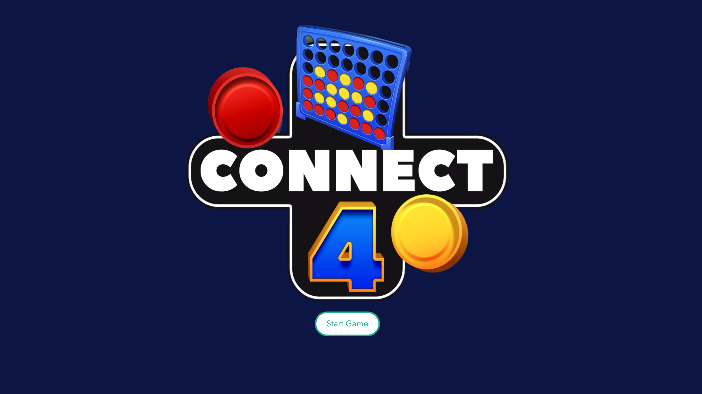
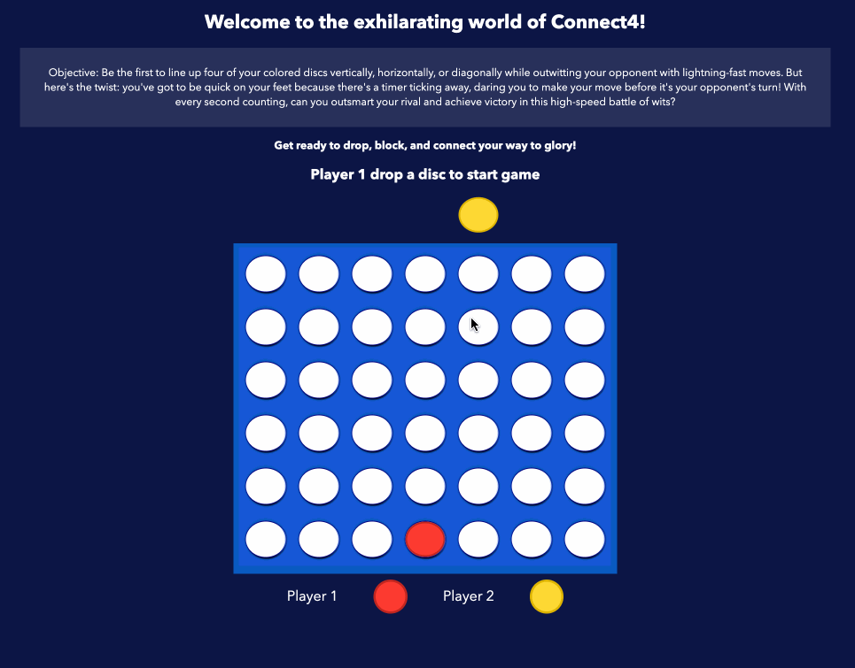
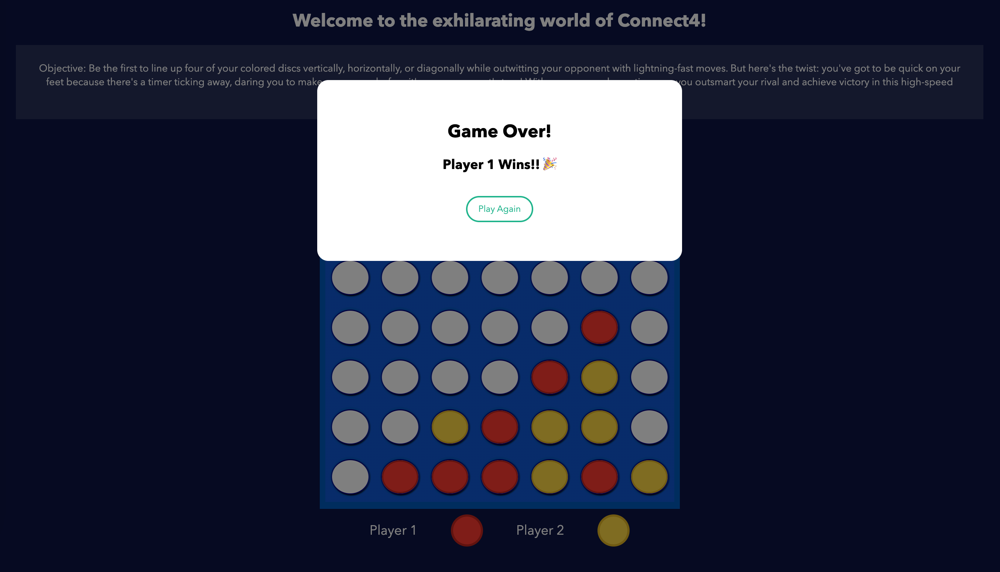

# Connect4: The Ultimate High-Speed Battle of Wits!

Welcome to the world of Connect4, where strategic brilliance meets the thrill of competition! Picture this: a vibrant battlefield of red and yellow, where players face off in a quest to line up four of their colored discs in a row. But wait, it's not just about dropping pieces randomly and hoping for the best—it's a cunning game of wits and tactical maneuvering!

In this timeless classic, players take turns dropping their colored discs into the grid, aiming to outsmart their opponent and block their moves while setting up their own masterful sequences. But here's the twist: players got to be quick on their feet because there's a timer ticking away, daring players to make their move before it's their opponent's turn! It's a game where every second counts, every placement is calculated, and every victory is sweetened with the taste of triumph!

So gather your courage, summon your inner genius, and prepare for the ultimate high-speed battle of wits in Connect4! It's time to drop, strategize, and conquer your way to victory—may the best player win!

# Screenshot

# Technologies Used

- JavaScript
- HTML
- CSS

# Getting Started

Number of players required: 2

Players select their colors, red or yellow, and take turns dropping their colored discs into the columns. It's crucial to strategize quickly as there's a time limit (10 seconds) for each move, ensuring the game's pace remains brisk and engaging.

The objective remains the same: be the first to form a line of four of your own discs horizontally, vertically, or diagonally while blocking your opponent's attempts.

Keep your wits sharp and your moves swift to secure victory in this fast-paced game of skill and foresight.

➡ [Click to Start Game](https://hongpeichua94.github.io/GA-SEI-PROJ/Connect4/)

# Next Steps / Future Enhancement

- [Feature] Input player names
- [Feature] Leaderboard

# References

- [How to Build Connect4 with Javascript HTML CSS](https://www.youtube.com/watch?v=4ARsthVnCTg&t=1238s)
- [Coding Connect4 with JavaScript](https://www.youtube.com/watch?v=kA9OOeUXXSU)
- [Connect4 Logo Asset](https://www.microsoft.com/en-ai/p/four-in-a-row-connect-4/9n18tqf8909s#activetab=pivot:overviewtab)

[def]: omescreen.pn
