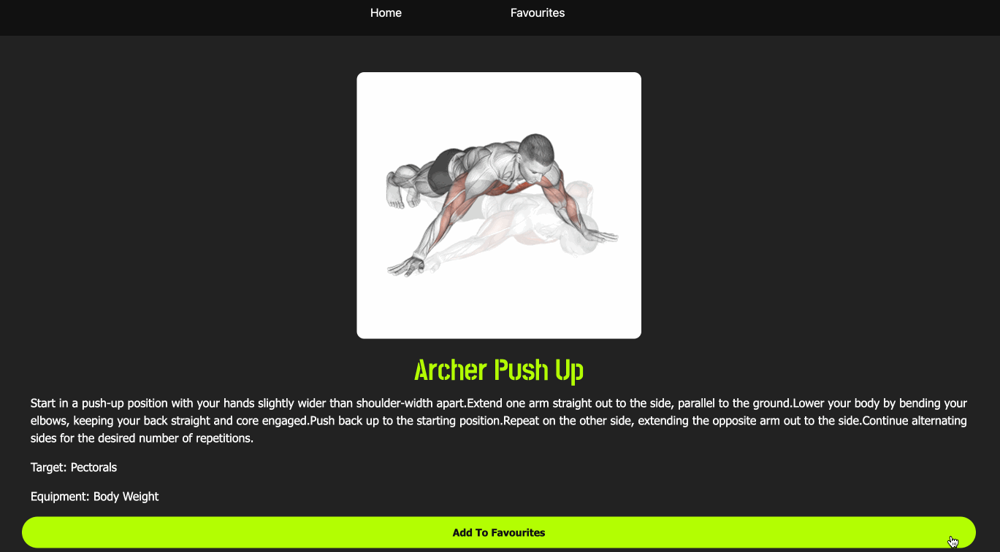
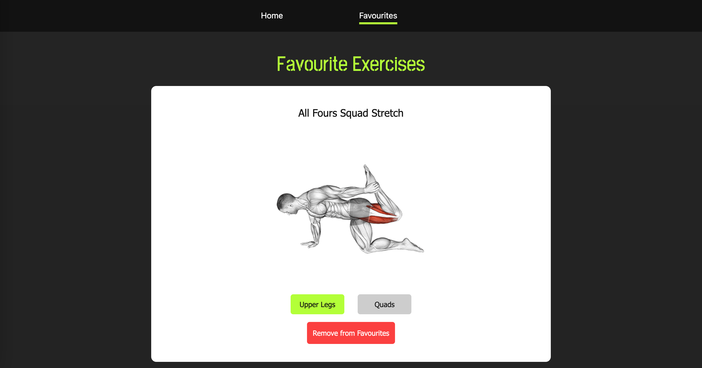

# FitFury: Power Up with Every Rep

Introducing FitFury – your ultimate fitness companion designed to ignite the fire within you and unleash your full potential! With over 1300 invigorating exercises at your fingertips, FitFury empowers you to sculpt your dream physique, elevate your endurance, and conquer your fitness goals like never before.

Fuel your passion for fitness with a diverse array of workouts meticulously curated to challenge every muscle and ignite your inner strength. Whether you're a seasoned gym enthusiast or just starting your fitness journey, FitFury offers something for everyone.

Unleash your inner beast and unleash the power of FitFury today. Let nothing stand in your way as you embark on a journey of transformation, strength, and unwavering determination. With FitFury by your side, the only limit is the one you set for yourself. Let's ignite the fire within and conquer your fitness goals together!

🔥 [POWER UP WITH EVERY REP NOW](https://fitfury.vercel.app) 🔥

# Screenshot

### Homescreen

### Search by Exercise, Target Muscles, or Equipment

### Exercise Detail

### Access and Manager Your Favourite Exercises

# Technologies Used

- React
- JSX
- CSS
- Node JS
- Airtable

# Getting Started

1. Fork it
2. Run `npm install` to install all the dependencies
3. Subscribe and get your API Key for the following API and update your `.env` file:   
<space> 3.1. [ExerciseDB API](https://rapidapi.com/justin-WFnsXH_t6/api/exercisedb)  
<space> 3.1. [Airtable API](https://airtable.com/appIlGtCLc9ElGJsL/api/docs)
4. In a new terminal, run `npm run dev`
5. Access the app via localhost (http://localhost:5173/)

# Next Steps/Future Enhancement

- [Feature] Create groups to store different favourite exercises
- [Feature] Manage groups of favourite exercises (ie. update group name)
- [Feature] Call exercise video API from YouTube
- [Feature] Interest form to "Find Personal Trainer"

# References

- [Build and Deploy a Modern React Fitness Exercises App With APIs](https://www.youtube.com/watch?v=KBpoBc98BwM&t=86s)
- [ExerciseDB API](https://rapidapi.com/justin-WFnsXH_t6/api/exercisedb)
- [Airtable API](https://airtable.com/appIlGtCLc9ElGJsL/api/docs)
- [Material UI](https://mui.com/material-ui/react-pagination/)
- ChatGPT 3.5
