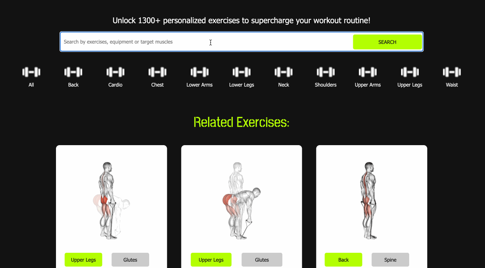

# FitFury: Power Up with Every Rep

Introducing FitFury – your ultimate fitness companion designed to ignite the fire within you and unleash your full potential! With over 1300 invigorating exercises at your fingertips, FitFury empowers you to sculpt your dream physique, elevate your endurance, and conquer your fitness goals like never before.

Fuel your passion for fitness with a diverse array of workouts meticulously curated to challenge every muscle and ignite your inner strength. Whether you're a seasoned gym enthusiast or just starting your fitness journey, FitFury offers something for everyone.

Get ready to transform your body and mind as you embark on a journey of self-discovery and empowerment. With expert guidance and personalized workout plans tailored to your unique needs, FitFury empowers you to break through barriers and exceed your limits.

# Screenshot

### Homescreen

### Search Results

### Exercise Detail

### Favourite

# Technologies Used

- React
- JSX
- CSS
- Airtable

# Getting Started

Unleash your inner beast and unleash the power of FitFury today. Let nothing stand in your way as you embark on a journey of transformation, strength, and unwavering determination. With FitFury by your side, the only limit is the one you set for yourself. Let's ignite the fire within and conquer your fitness goals together!

🔥 [POWER UP WITH EVERY REP NOW](https://fitfury.vercel.app/home) 🔥

# Next Steps/Future Enhancement

- Feature to create groups to store different favourite exercises
- Feature to manage groups (ie. update group name)
- Implement interest form to "Find Personal Trainer"

# References

- [ExerciseDB API](https://rapidapi.com/justin-WFnsXH_t6/api/exercisedb)
- [Airtable API](https://airtable.com/appIlGtCLc9ElGJsL/api/docs)
- [Material UI](https://mui.com/material-ui/react-pagination/)
- ChatGPT 3.5
