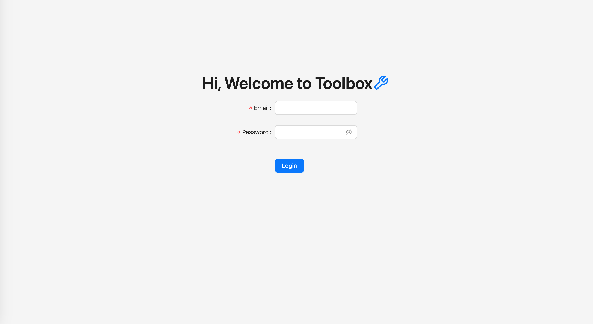
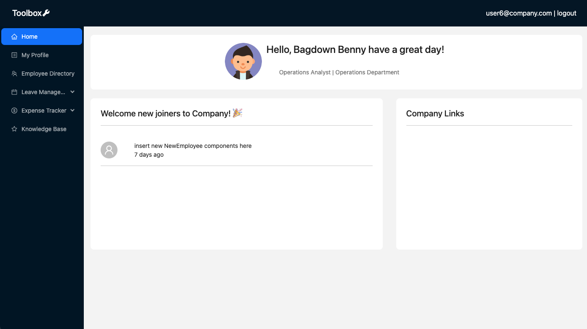
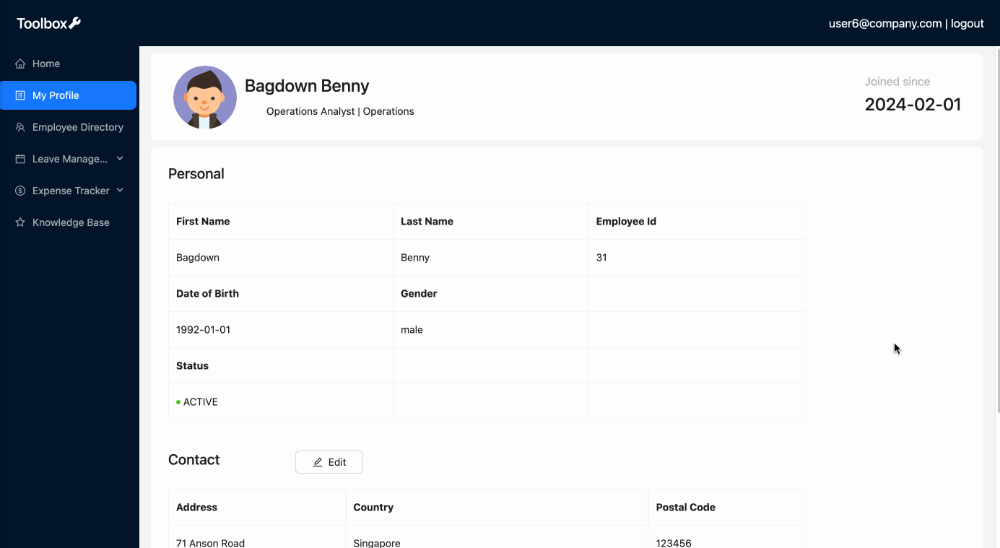
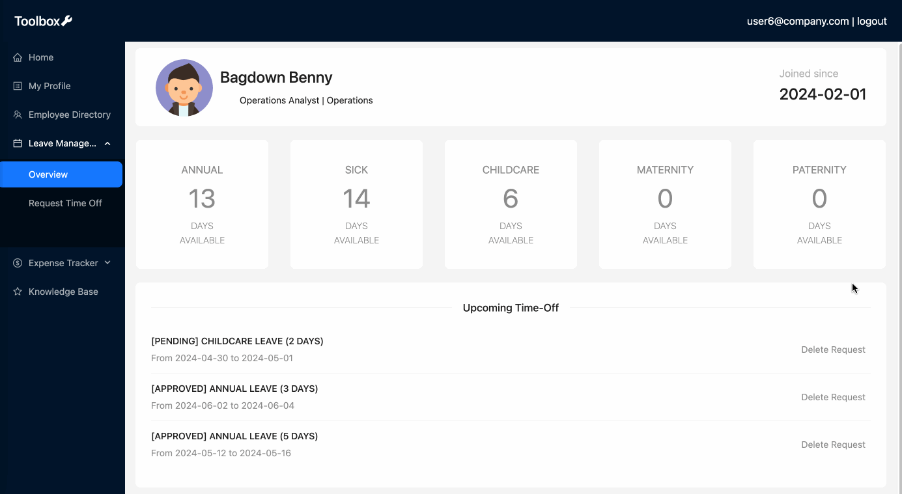
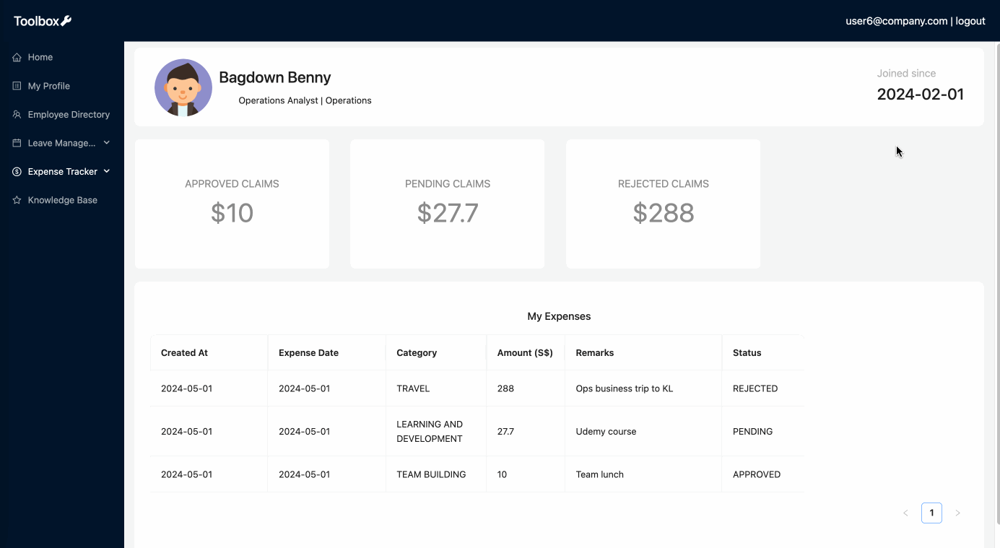
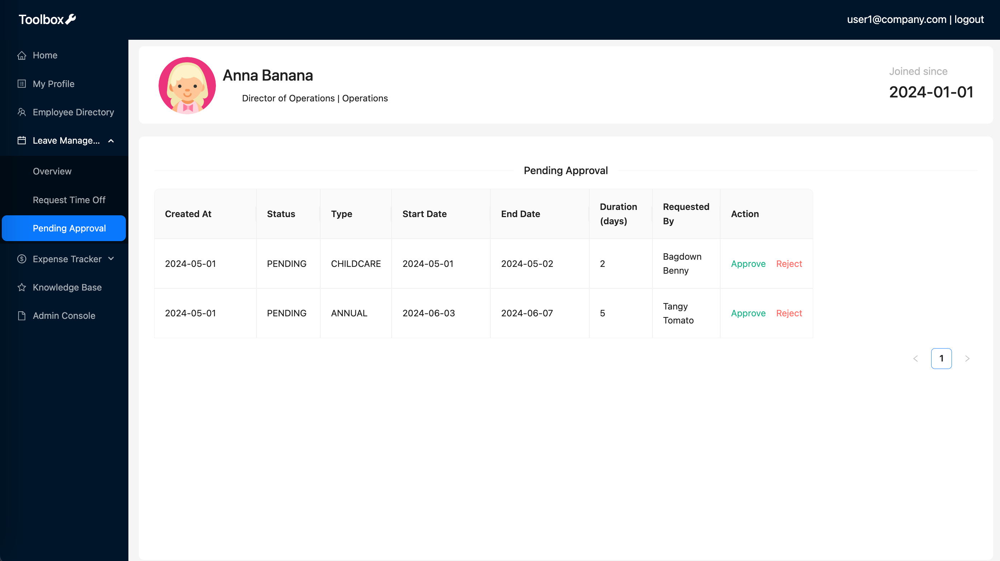
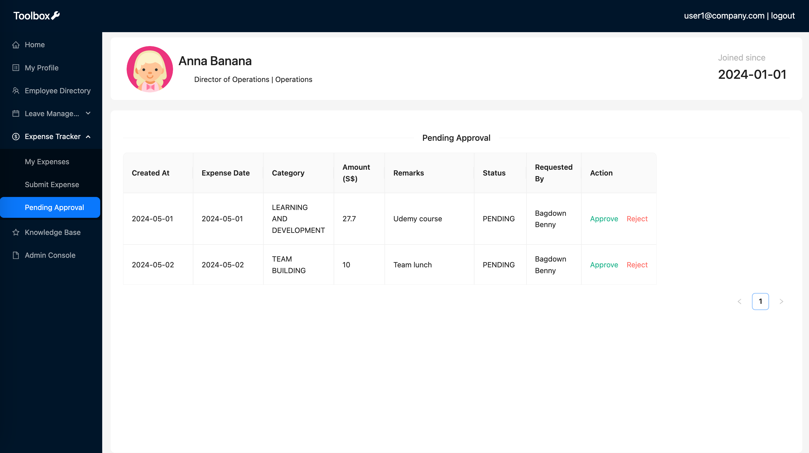
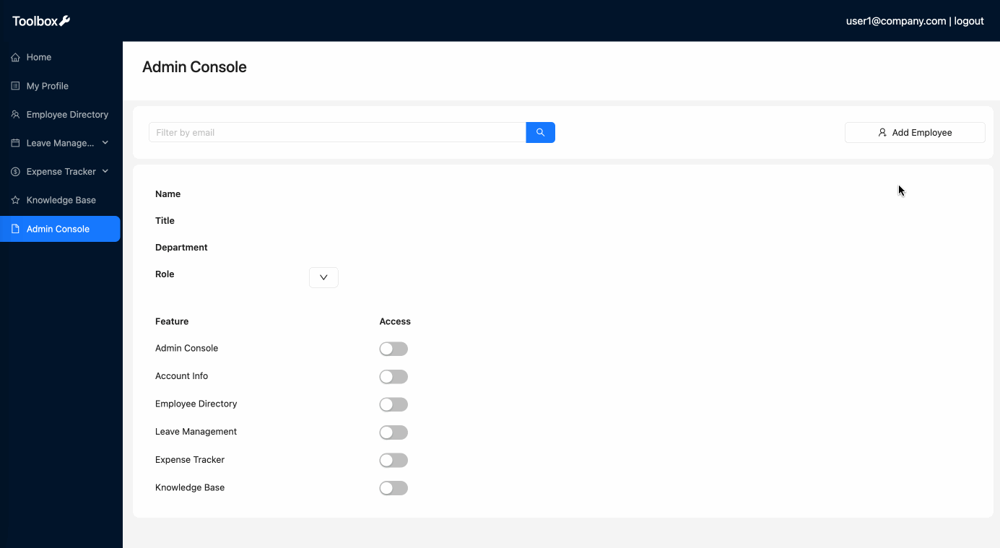
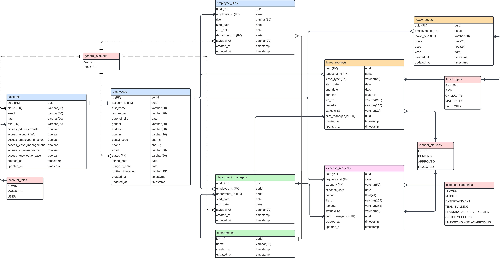

# Toolbox

Introducing Toolbox, your backstage pass to streamlining company operations without the corporate jargon. This internal tool isn't just about managing employee profiles; it's your go-to for orchestrating time-off requests and expense management with finesse.

Imagine a digital haven where updating your profile is as easy as updating your social media status. Need a day off or a reimbursement for that business lunch? Toolbox has your back, offering seamless request and approval processes. So, let's banish the bureaucracy and embrace a smoother, more streamlined way of working with Toolbox by your side.

# Features

#### Welcome to Toolbox!




## User Access

#### My Profile: Manage your profile and keep your contact details updated



#### Employee Directory: Find your work bestie or track down that elusive department head who's always one step ahead of the game


#### Leave management: Keep track of your leave balance, upcoming time-off and submit leave application



#### Expense management: Keep track of your expense claims and submit claims for approval



## Manager Access

#### Approve direct report's leave application and/or expense claims




## Admin Access

#### Admin Console: Create account for new employees and manage user access



# Technologies Used
   


# React Hierarchy
<pre>
App
|__ Profile
      |__ ProfileBanner
      |__ UpdateProfileModal
|__ Login
|__ LeaveManagement
      |__ ProfileBanner
      |__ LeaveBalanceCard
      |__ UpcomingLeave
|__ LeaveRequest
      |__ ProfileBanner
|__ LeavePending
      |__ ProfileBanner
|__ Expense
      |__ ProfileBanner
      |__ ExpenseSummaryCard
|__ ExpenseSubmit
      |__ ProfileBanner
|__ ExpensePending
      |__ ProfileBanner
|__ Directory
|__ Dashboard
      |__ NewEmployee
|__ Admin
      |__ CreateAccountModal
|__ ComingSoon
|__ NotFound
</pre>

# Entity Relationship Diagram (ERD)



# Getting Started

### Backend Setup

1. Run `npm init -y` to initialize the project and create a package.json file
2. Install all the packages and dependencies <br />
<pre>
  npm i express
  npm i -D nodemon
  npm i express-validator 
  npm i jsonwebtoken uuid bcrypt 
  npm i cors helmet express-rate-limit
  npm i dotenv
  npm i pg
</pre>
4. Create your .env file with the following variables:
```
PORT=5001
ACCESS_SECRET=<YOUR_ACCESS_SECRET>
REFRESH_SECRET=<YOUR_REFRESH_SECRET>
DB_USER=<YOUR_DB_USER>
DB_PASSWORD=<YOUR_DB_PASSWORD>
```

### Frontend Setup

1. Run `npm i` to install all the dependencies
2. Run `npm i react-router-dom` to install react-router-dom
3. Run `npm I antd --save` to install Ant Design
4. Run `npm i jwt-decode` to install jwt-decode
5. Create your .env file with the following variables:
`VITE_SERVER=http://localhost:5001`

# Next Steps
1. Create an Onboarding Portal to streamline and manage the onboarding process for new employees within the organization
2. Create an OKR feature for managers to effectively set, track, and align team and individual goals within the organization
3. Create a Knowledge Base for employees to access a centralized repository of information, resources, and best practices within the organization

# References
1. [Ant Design](https://ant.design/components/overview/)
2. ChatGPT 3.5
